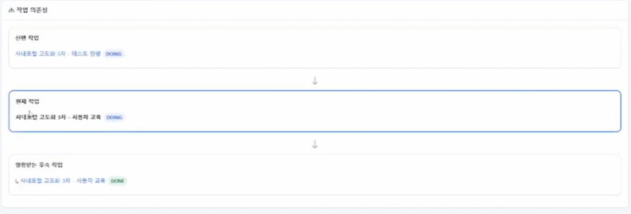
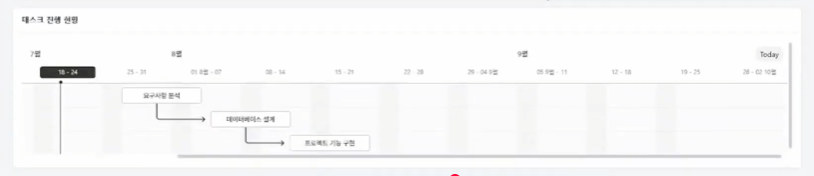
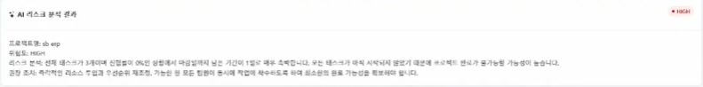
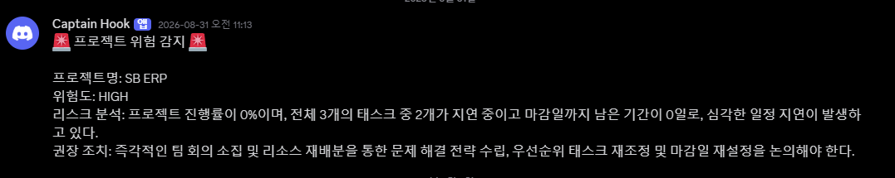

# SBerp v2 — 프로젝트·태스크·공지 관리 모듈 (태스크 의존성 & AI 리스크 분석 & 리포트 자동화)

6인 팀으로 진행한 사내 ERP 프로젝트(spring-breeze) v2 버전 중, 제가 담당한 프로젝트/태스크 모듈만 정리한 저장소입니다.
v1(CRUD 기반)에서 태스크 간 의존성 관리, 일정 자동 재계산, AI 기반 리스크 분석 및 리포트 자동화 기능을 추가했습니다.

팀 전체 코드 → https://github.com/yoonguri988/spring-breeze-erp

## 📌 프로젝트 개요

| 항목 | 내용 |
|---|---|
| 프로젝트명 | SBerp v2 (spring-breeze-erp-v2) |
| 팀명 | Spring Breeze (Team 04) |
| 개발 기간 | 2026.07.02 ~ 2026.07.15 (14일) |
| 팀 인원 | 4명 |
| 도메인 | Enterprise Resource Planning |
| 핵심 도메인 | 6개 (회사 · 부서 · 자원 예약 / 인사 · 평가 · 권한 / 전자결재 / 프로젝트 · 태스크 · 공지) |
| 신규 기능 | 8종 이상 (AI/외부 API 연동) |
| 대상 사용자 | 중소 규모 기업 관리자 / 임직원 |
| 담당 모듈 | 05. 프로젝트 · 태스크 |
| v1 대비 추가 범위 | 프로젝트 · 태스크 · 공지 / 태스크 의존성(선후행) 관리, Gantt 시각화, 동시성 제어, OpenAI 리스크 분석, 주간 리포트 자동화 |
## 🛠 기술 스택

<table>
<tr>
<td valign="top" width="50%">

**Backend**

> Spring Security로 인증 · 인가, MyBatis로 SQL Mapper 관리

**Frontend (View Layer)**

> SSR 기반, thymeleaf-layout-dialect로 레이아웃 관리

**Database**

</td>
<td valign="top" width="50%">

**External API / AI**

> GPT: 결재 양식 생성 · 평가 리포트 요약 · 부서 이관 추천 · 태스크 리스크 판정
> Naver OCR: 사업자등록증 인식 · 국세청 API: 사업자 진위확인
> Discord: 실시간 알림 · Google Docs: 주간 보고서 자동 저장 · PDFBox: 개인 리포트 PDF

**협업 도구**

</td>
</tr>
</table>

## Features

### 태스크 의존성 시스템
`parent_task_id` 자기참조 구조로 선후행 관계를 관리하고, 일정 변경 시 하위 태스크 일정을 자동 재계산합니다.
- Oracle DDL: 트리거 + CHECK 제약조건 + 인덱스
- Recursive CTE 기반 의존성 트리 조회
- DFS 기반 순환 참조(cyclic) 탐지 (`isCyclic()`)
- `ChronoUnit.DAYS` 기반 cascade 일정 재계산

### Gantt 차트 시각화
Frappe Gantt를 연동해 프로젝트-태스크 일정을 시각화했습니다.

### 동시성 제어 (Concurrency Control)
여러 사용자가 동시에 같은 태스크 트리를 수정할 때의 정합성을 보장합니다.
- `SELECT FOR UPDATE WAIT 5`를 서브트리 단위로 적용 (`START WITH taskId CONNECT BY PRIOR task_id = parent_task_id`)
- 락 획득 → 업데이트 → cascade 재계산을 하나의 `@Transactional`로 처리 (`TaskDependencyServiceImpl.updateTaskSchedule`)
- 부모/자식 동시 수정 테스트로 순차 처리(두 번째 요청이 첫 요청 커밋 후 진행) 검증 완료

### AI 기반 프로젝트 리스크 분석
OpenAI GPT API로 프로젝트 진행 상황을 분석하고, 위험도가 높으면 Discord로 알림을 보냅니다.
- 버튼 클릭 시 온디맨드 실행 (스케줄러 아님) — PM이 직접 분석 트리거
- 분석 결과 HIGH일 경우 Discord Webhook 알림 발송

### 주간 리포트 자동화
- **팀장용**: `@Scheduled` 매주 월요일 자동 실행 → Google Docs/Drive에 저장
- **개발자 개인용**: 버튼 클릭 시 온디맨드 생성 (Google Docs 템플릿 복사 → 값 치환 → Drive API로 PDF 변환 → PDFBox로 표지 제거)

## 📅 개발 일정 (14일)

| 단계 | 기간 | 내용 |
|---|---|---|
| Phase 1 | 07.02 ~ 07.07 | 리팩토링 — Spring Boot · Thymeleaf · Oracle 마이그레이션 |
| Phase 2 | 07.08 ~ 07.12 | 신규 기능 — 팀원별 신규 페이지 · AI/API 통합 (M1: 1차 개발 완료) |
| Phase 3 | 07.13 ~ 07.15 | QA & 시연 — 통합 테스트 · 리허설 · 시연 준비 (M2: 2차 개발 완료) |

## ✅ 회고

- 기술 적용 자체보다 사용자에게 실제로 필요한 기능을 고민하는 과정이 더 중요하다는 점을 확인했습니다.
- 양식 수정 · 삭제가 기존 문서에 미치는 영향을 고려해 소프트 삭제와 버전 관리를 설계하는 습관이 생겼습니다.
- 하나의 기능 변경이 연관 데이터 전체에 미치는 영향을 먼저 검토하는 것의 중요성을 배웠습니다.
- 단순해 보이는 CRUD에도 FK 정합성 · 트랜잭션 · 예외 처리 등 다양한 안전장치가 필요하다는 것을 체감했습니다.

## 📁 주요 설정 / 기술 포인트

- `pom.xml` — Spring Boot 3.5.16 · Java 17, MyBatis, Spring Security, Oracle JDBC(ojdbc11), Thymeleaf Layout Dialect, OAuth2 Client, PDFBox, jsoup 등
- MyBatis Mapper XML 기반 SQL 관리
- Spring Security 기반 인증 · 인가, 세션 관리
- Oracle 18c 재귀 CTE, 복합 인덱스 등을 활용한 성능 최적화

## Troubleshooting

- **태스크 목록 페이징 오류**: 원시 페이지 번호를 그대로 사용하던 것을 `PagingUtil.getPstartno()` 기반으로 수정
- **`isCyclic` NPE**: `.map().findFirst()` 순서 문제로 발생 → 순서 수정으로 해결
- **`TaskMapper.xml` 누락 컬럼**: `t.pm_id` 누락으로 인한 조회 오류 수정
- **권한 관련 접근 제어 이슈**: 팀원의 `SecurityConfig` 변경으로 발생한 `/eval/period/list` 접근 문제 해결
- **Oracle 시드 SQL `ROLE_` 접두사 중복 버그** 수정
- **OpenAI API 키 공백 버그**: 키 앞뒤 공백 문자로 인증 실패 → trim 처리로 해결

## Related Repositories
- v1 (Spring MVC + JSP): https://github.com/dndkd97/SB_ERP_V1
- v3 (REST API + AI 채용관리): https://github.com/dndkd97/SB_ERP_V3
- 팀 전체 원본: https://github.com/yoonguri988/spring-breeze-erp
